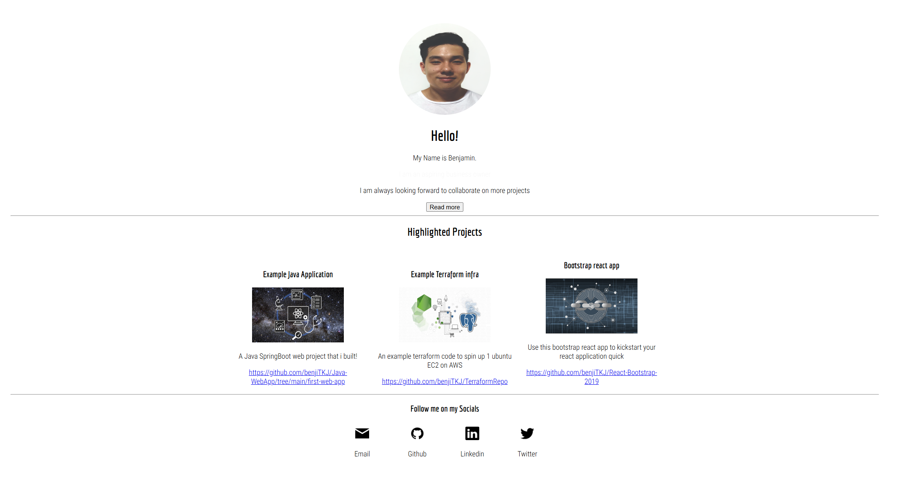

# Benjamin Tan Portfolio Website (Sample)

Portfolio website created using React framework



## Table of contents

- [Tech Stack](#tech-stack)
- [How to run locally](#run-locally)
- [Build docker image](#build-docker-image)
- [Run in production](#run-in-production)

### Tech Stack

<div>
    &nbsp;
    &nbsp;
    &nbsp;
</div>

- Frontend: React + Javascript
- Backend: - 
- Infrastructure/Environment: Docker  

### Run locally

- Install dependencies
```sh
npm install
```

- Quick start at port 3000
```sh
npm start
```

- Open [http://localhost:3000](http://localhost:3000) to view in the browser

### Build docker image

- Build docker image locally
```sh
docker build -t benjitkj-portfolio-website:latest .
```

### Run in production

- There are a few ways you could run this:

1) Standalone docker service in server
- Run a docker service in the server (eg AWS EC2)
```sh
docker run -d --name portfolio-website benjitkj-portfolio-website:latest
```

2) Run via docker compose in server
- Run using [docker compose file](./docker-compose.yml)
```sh
docker compose up -d 
```